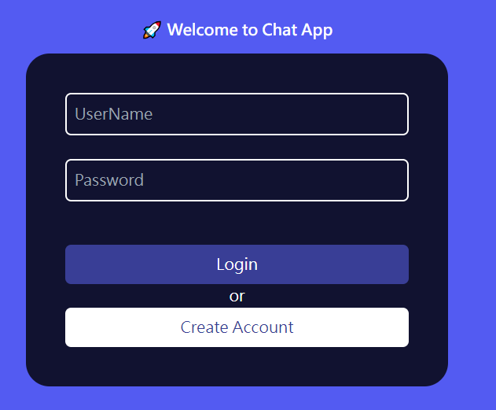
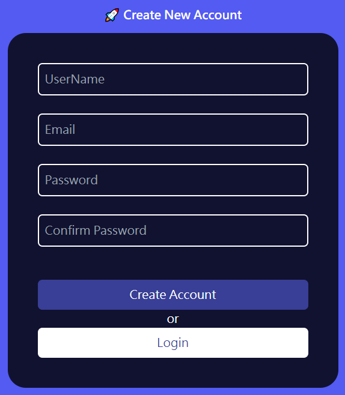
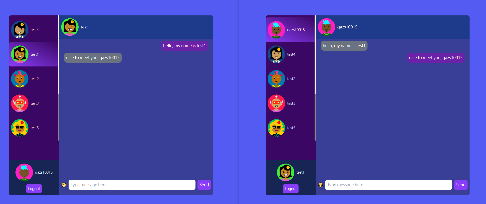

# ChatApp
Practice how to implement ChatApp, here is [reference video](https://www.youtube.com/watch?v=otaQKODEUFs)

[Demo](https://react-simple-chat-app-six.vercel.app/login)

## All features ChatApp has

- Login
- Register
- Choose free image sources as avatar
- Real-time chat 1 on 1

## All tools I use

- [Nodejs](https://nodejs.org/en/download)
- [Mongodb](https://www.mongodb.com/docs/manual/administration/install-community/)
- [React](https://react.dev/)
- [React Router](https://reactrouter.com/en/main)
- [Zod](https://zod.dev/)
- [React Hook Form](https://react-hook-form.com/)
- [TailwindCSS](https://tailwindcss.com/)

## Installation Guide

This project is divided into 2 project, frontend and backend

- frontend

```shell
cd frontend
npm install
npm start
```


- backend

```shell
cd frontend
npm install
npm start
```

Open `localhost:3000` in your browser to see ChatApp and `localhost:5000` is backend host


### There are available accounts has already register

- test1/123456
- test2/123456
- test3/123456
- test4/123456
- test5/123456
- test6/123456

### There are some screenshots for ChatApp




